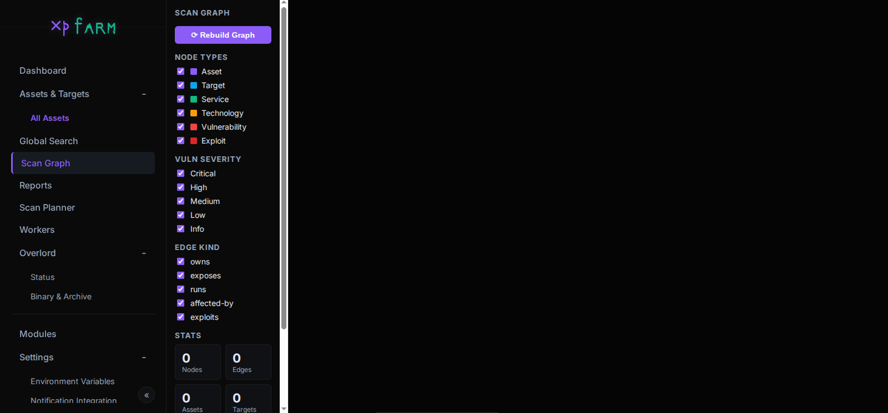
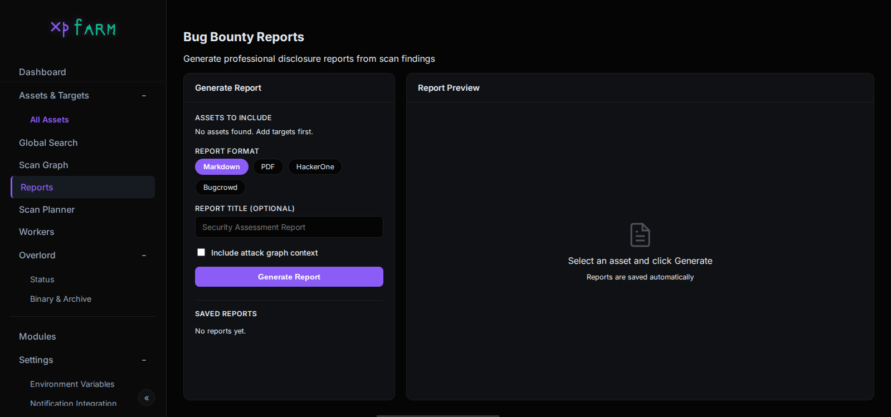
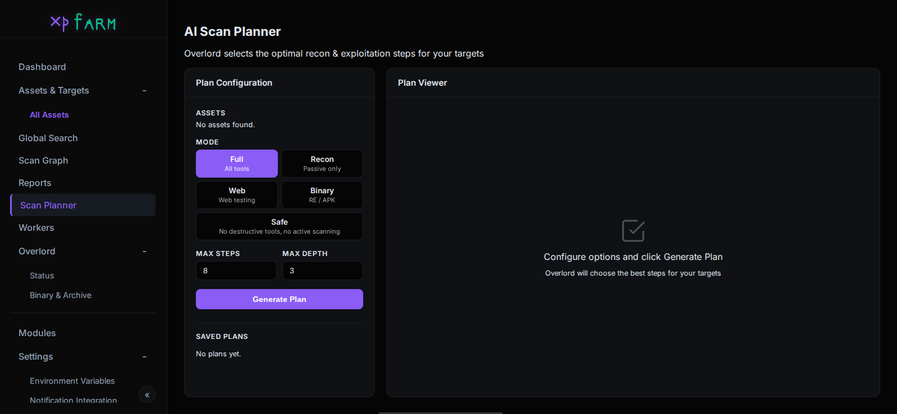
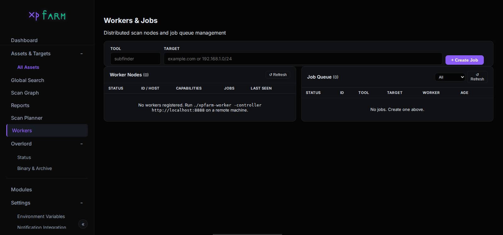

# XPFarm

An open-source AI-augmented offensive security platform that wraps well-known security tools behind a unified web UI — with distributed scanning, AI-generated reports, a smart scan planner, an interactive attack graph, and a community Plugin SDK.

[](https://ko-fi.com/canuk40)

> Also check out [ObsidianBox Modern](https://play.google.com/store/apps/details?id=com.busyboxmodern.app&hl=en_CA) on Google Play.

---

### Index

| Section | Description |
|---|---|
| [Why](#why) | Motivation and philosophy |
| [Wrapped Tools](#wrapped-tools) | The 10 open-source tools orchestrated by XPFarm |
| [Architecture Map](#architecture-map) | Full system architecture, scan pipeline, data flow |
| [Overlord — AI Analysis](#overlord--ai-analysis) | AI agent for binary/malware/web analysis |
| [Bug Bounty Reports](#bug-bounty-reports) | AI-generated professional disclosure reports |
| [AI Scan Planner](#ai-scan-planner) | AI-optimized recon & exploitation step planner |
| [Distributed Workers](#distributed-workers) | Run scans across multiple machines in parallel |
| [Scan Graph](#scan-graph) | Interactive graph of assets, services, vulns, exploits |
| [Plugin SDK](#plugin-sdk) | Community-extensible Tool, Agent, and Pipeline system |
| [Finding Normalization Engine](#finding-normalization-engine) | Unified, enriched, deduplicated security findings |
| [What's New](#whats-new) | Recent security, reliability, and UX improvements |
| [Setup](#setup) | Build and deployment instructions |
| [TODO](#todo) | Planned features and roadmap |

---



---

## Why

Tools like [Assetnote](https://www.assetnote.io/) are great — well maintained, up to date, and transparent about vulnerability identification. But they're not open source. There's no need to reinvent the wheel either, as plenty of solid open-source tools already exist. XPFarm wraps them together so you can have a vulnerability scanner that's open source and less corporate.

The focus was on building a vuln scanner where you can see what fails or gets removed in the background, instead of wondering about the mystery. Everything the scan pipeline does is surfaced to the user.

---

## Wrapped Tools

- [Subfinder](https://github.com/projectdiscovery/subfinder) — subdomain discovery
- [Naabu](https://github.com/projectdiscovery/naabu) — port scanning
- [Httpx](https://github.com/projectdiscovery/httpx) — HTTP probing
- [Nuclei](https://github.com/projectdiscovery/nuclei) — vulnerability scanning
- [Nmap](https://nmap.org/) — network scanning
- [Katana](https://github.com/projectdiscovery/katana) — JS crawling
- [URLFinder](https://github.com/projectdiscovery/urlfinder) — URL discovery
- [Gowitness](https://github.com/sensepost/gowitness) — screenshots
- [Wappalyzer](https://github.com/projectdiscovery/wappalyzergo) — technology detection
- [CVEMap](https://github.com/projectdiscovery/cvemap) — CVE mapping


#### Credits

<table>
  <tr>
    <td align="center">
      <a href="https://github.com/Asjidkalam">
        <br/>
        <sub>Asjidkalam</sub>
      </a>
    </td>
    <td align="center">
      <a href="https://github.com/jamoski3112">
        <br/>
        <sub>jamoski3112</sub>
      </a><br/>
      <sub><a href="https://rahulr.in/reversing-a-cheap-ip-camera-to-root/">Research</a></sub>
    </td>
  </tr>
</table>

---

## Architecture Map

```mermaid
flowchart TB
    subgraph ENTRY["Entrypoint — main.go"]
        M1["Parse Flags (-debug)"]
        M2["InitDB — SQLite + WAL + GORM"]
        M3["InitModules — 10 tool wrappers"]
        M4["Load Plugins — normalization/all + plugins/all"]
        M5["Health Check — auto-install missing tools"]
        M6["CheckAndIndexTemplates — Nuclei versioning"]
        M7["StartServer — Gin on :8888"]
        M1 --> M2 --> M3 --> M4 --> M5 --> M6 --> M7
    end

    subgraph UI_LAYER["Web UI — internal/ui/server.go"]
        direction TB
        GIN["Gin HTTP Server\nEmbedded templates + static\nCSRF origin-check middleware"]

        subgraph Pages["HTML Pages"]
            P1["Dashboard — SSE live stage progress"]
            P2["Assets & Targets"]
            P3["Global Search — paginated + truncation"]
            P4["Scan Graph — Cytoscape.js"]
            P5["Bug Bounty Reports"]
            P6["AI Scan Planner"]
            P7["Workers & Jobs"]
            P8["Overlord Chat + Binary Upload"]
            P9["Modules"]
            P10["Settings — AES-256-GCM encrypted"]
        end

        GIN --> Pages
    end

    subgraph SCAN_ENGINE["Scan Engine — internal/core/"]
        direction TB
        SM["ScanManager\nSingleton, mutex-guarded\nPanic recovery + SSE broadcast"]

        subgraph PIPELINE["8-Stage Scanning Pipeline"]
            direction TB
            S1["1. Subfinder — Subdomain Discovery"]
            S2["2. Filter & Save — Cloudflare / Localhost / Alive"]
            S3["3. Naabu — Port Scanning (5-worker pool)"]
            S4["4. Nmap — Service + Version Detection"]
            S5["5. Httpx — HTTP Probing + Metadata"]
            S6["6. Parallel Web — Screenshots, Crawl, URLs, Tech"]
            S7["7. CVEMap — CVE lookup by product/tech"]
            S8["8. Nuclei — Vulnerability Scanning"]
            S1 --> S2 --> S3 --> S4 --> S5 --> S6 --> S7 --> S8
        end

        SM --> PIPELINE
    end

    subgraph REPORTS["Bug Bounty Reports — internal/reports/"]
        RG["GenerateReport()\nCollects DB context + graph\nOverlord AI generation\nFallback built-in templates"]
        RF["Formats: Markdown · PDF · HackerOne · Bugcrowd"]
        RS["Storage: internal/storage/reports/"]
        RG --> RF --> RS
    end

    subgraph PLANNER["AI Scan Planner — internal/planner/"]
        PL["GenerateScanPlan()\nGathers asset/finding/graph context\nPolls Overlord for JSON plan\nFallback heuristic plan"]
        PC["Capability Registry — 26 capabilities\n10 built-in modules + 16 Overlord agents\nRisk levels: safe / active / destructive"]
        PS["ExecutePlanWithLogs()\nSSE log streaming per step\nRoutes builtin vs Overlord agent steps"]
        PL --> PC --> PS
    end

    subgraph DISTRIBUTED["Distributed Workers — internal/distributed/"]
        DW["Worker Binary — cmd/worker/main.go\n./xpfarm-worker -controller http://host:8888"]
        DC["Controller — token auth, heartbeat monitor\nAtomically claims jobs from queue"]
        DS["Scheduler — BestWorkerForTool()\nRoutes by capability + active job count"]
        DJ["Job Queue — internal/storage/jobs/\nClaim via DB transaction, 30min timeout"]
        DW --> DC --> DS --> DJ
    end

    subgraph OVERLORD["Overlord — AI Agent Subsystem"]
        OV_PROXY["Overlord Proxy — internal/overlord/"]

        subgraph OV_AGENTS["22 Specialized Agents"]
            OA1["Binary RE — re-explorer, re-debugger, re-decompiler, re-scanner"]
            OA2["APK — apk-recon, apk-dynamic, apk-decompiler"]
            OA3["Web + Exploit — web-tester, re-exploiter, secrets-hunter, recon"]
        end

        subgraph OV_TOOLS["70+ TypeScript Tools"]
            OT1["radare2, ghidra, binwalk, frida, angr, strings"]
            OT2["semgrep, gitleaks, gau, corscanner, whatweb"]
            OT3["git_dumper, js_scraper, crypto_solver, ropper"]
        end

        subgraph PROVIDERS["21 AI Providers"]
            PR1["Anthropic · OpenAI · Groq · DeepSeek"]
            PR2["Ollama (local) · xAI · OpenRouter · Cerebras"]
        end

        OV_PROXY --> OV_AGENTS
        OV_PROXY --> OV_TOOLS
        OV_PROXY --> PROVIDERS
    end

    subgraph SCAN_GRAPH["Scan Graph — internal/graph/"]
        GB["BuildGraph() — queries 5 tables\nDeduplicates nodes + edges"]
        subgraph GNODES["Node Types"]
            GN1["asset #8b5cf6"]
            GN2["target #0ea5e9"]
            GN3["service #10b981"]
            GN4["tech #f59e0b"]
            GN5["vuln #ef4444"]
            GN6["exploit #dc2626"]
        end
        GB --> GNODES
    end

    subgraph DATABASE["Database — internal/database/ + internal/storage/"]
        DB["SQLite + WAL Mode\nGORM ORM\n10 open / 5 idle conns, 64MB WAL cap"]
        subgraph MODELS["Data Models"]
            DM1["Asset · Target · Port · WebAsset"]
            DM2["Vulnerability · CVE · ScanResult"]
            DM3["ScanProfile · NucleiTemplate · SavedSearch"]
            DM4["Setting (AES-256-GCM encrypted)"]
            DM5["Report · Plan · WorkerRecord · JobRecord"]
        end
        DB --> MODELS
    end

    subgraph DOCKER["Docker — docker-compose.yml"]
        DC1["xpfarm — Go app :8888"]
        DC2["overlord — OpenCode :3000"]
        DC3["mobsf — Mobile scan :8000 (optional)"]
        DC1 <-->|xpfarm-network| DC2
        DC1 <-->|xpfarm-network| DC3
    end

    M7 --> GIN
    GIN --> SCAN_ENGINE
    GIN --> REPORTS
    GIN --> PLANNER
    GIN --> DISTRIBUTED
    GIN --> OVERLORD
    GIN --> SCAN_GRAPH
    GIN --> DATABASE
```



---

## Overlord — AI Analysis

Overlord is a built-in AI agent powered by [OpenCode](https://opencode.ai) that can analyze binaries, archives, APKs, and web targets. Upload a file and chat with it — the agent uses radare2, strings, file triage, Frida, and more to investigate your target.

- **Live streaming output** — see thinking, tool calls, and results as they happen
- **Session history** — switch between previous sessions, auto-restored on page refresh
- **Multi-provider** — Anthropic, OpenAI, Groq, Ollama (local), DeepSeek, xAI, and 15+ more
- **Stop button** — abort long-running analysis at any time
- **70+ TypeScript tools** — radare2, Ghidra, Frida, binwalk, angr, Semgrep, Gitleaks, and more
- **22 specialized agents** — binary RE, APK analysis, web testing, exploit generation, secrets hunting
- **500 MB upload cap** with MIME type validation


---

## Bug Bounty Reports



Generate professional disclosure reports from your scan findings with a single click. Overlord AI synthesizes your asset inventory, vulnerability findings, graph context, and CVE data into a polished report.

**Formats:**

| Format | Output |
|---|---|
| `Markdown` | Clean `.md` with executive summary, findings table, remediation |
| `PDF` | Rendered via wkhtmltopdf, falls back to HTML |
| `HackerOne` | Platform-optimized structure with CVSS, reproduction steps |
| `Bugcrowd` | Title, severity, VRT category, impact, PoC |

**How it works:**
1. Select one or more assets to include
2. Choose format and optional title
3. Overlord AI generates a structured report from your live findings + attack graph
4. Download as `.md`, `.html`, or `.pdf` — or copy the raw Markdown
5. Reports are saved and can be re-downloaded at any time

---

## AI Scan Planner



Overlord selects the optimal recon and exploitation steps for your targets based on what's already been discovered — asset inventory, existing findings, graph structure, and available tool capabilities.

**Modes:**

| Mode | What it plans |
|---|---|
| `Full` | All 26 capabilities — complete assessment |
| `Recon` | Subdomain, port, HTTP, tech discovery only |
| `Web` | HTTP probing, crawling, web vulnerability checks |
| `Binary` | Overlord binary/APK/malware analysis agents |
| `Safe` | Zero-risk read-only tools only |

**How it works:**
1. Select target assets, mode, and step limits
2. Overlord AI analyses your existing data and generates a prioritized JSON plan
3. Each step shows: tool/agent, target, reasoning, and expected output
4. Click **Execute** to run the plan — steps stream live progress via SSE
5. Plans are saved and re-executable at any time

**Capability registry:** 10 built-in modules + 16 Overlord agents, each tagged with risk level (`safe` / `active` / `destructive`) and category for mode filtering.

---

## Distributed Workers



Run scans across multiple machines in parallel. Deploy worker nodes on remote hosts and they automatically register with the controller, poll for jobs, execute tools locally, and post results back.

**Deploy a worker:**

```bash
./xpfarm-worker -controller http://xpfarm-host:8888 -id worker-1 -labels high-bandwidth,internal
```

**How it works:**
- Workers register with a crypto token (32-byte random, one per worker)
- Heartbeat every 10 seconds — workers marked offline after 45s silence
- Jobs claimed atomically via DB transaction — no double-execution
- Scheduler routes jobs to the best available worker by capability and load
- 30-minute timeout per job; failed jobs are re-queued on worker disconnect

**Job queue:** Create jobs from the Workers UI or via `POST /api/jobs/create`. The queue shows live status, assigned worker, and result output.

---

## Scan Graph


XPFarm builds a unified directed graph of every entity discovered during scanning, making it trivial to answer questions like _"what services are running tech with an active CVE exploit?"_ or _"show me everything reachable from this asset"_.

**Node types:**

| Node | Color | Populated from |
|---|---|---|
| `asset` | purple `#8b5cf6` | Asset table |
| `target` | blue `#0ea5e9` | Target table |
| `service` | green `#10b981` | Port table (open ports) |
| `tech` | amber `#f59e0b` | WebAsset.TechStack + Port.Product |
| `vuln` | red `#ef4444` | Vulnerability + CVE tables |
| `exploit` | dark-red `#dc2626` | CVEs with `IsKEV=true` AND `HasPOC=true` |

**Example path:**

```
example.com (asset)
  └─owns──► www.example.com (target)
              ├─exposes──► 443/tcp https (service)
              │              └─runs──► nginx 1.24 (tech)
              ├─affected-by──► CVE-2023-44487 (vuln)
              │                   └─exploits──► Exploit: CVE-2023-44487
              └─affected-by──► http-missing-security-headers (vuln)
```

- Full-page interactive Cytoscape.js canvas — zoom, pan, drag nodes
- Left panel: filter by node type, vuln severity, edge kind
- Click any node → side panel shows all properties + deep-link to detail page
- "Rebuild Graph" re-queries the live database

---

## Plugin SDK

XPFarm is extensible via a community Plugin SDK. Anyone can add new Tools, Agents, and Pipelines without touching core code.

```
plugins/
├── all/all.go                    ← add your plugin import here
├── example-echo/                 ← minimal starter template
├── example-repo-scanner/         ← mock repo scanner example
├── repo-semgrep/                 ← Semgrep SAST plugin (production-ready)
└── repo-secrets/                 ← Gitleaks + SecretFinder plugin (production-ready)
```

**Writing a plugin — three steps:**
1. Create `plugins/my-plugin/plugin.go` — implement `Tool` and/or `Agent`, call `plugin.RegisterTool()` / `plugin.RegisterAgent()` in `init()`
2. Create `plugins/my-plugin/plugin.yaml` — metadata
3. Add `_ "xpfarm/plugins/my-plugin"` to `plugins/all/all.go`

`GET /api/plugins` lists all registered tools, agents, pipelines, and manifests.

---

## Finding Normalization Engine

Raw scanner outputs from Nuclei, Nmap, Semgrep, and Gitleaks are normalized into a unified `Finding` model, enriched with live threat intelligence, deduplicated, and grouped.

```
POST /api/normalize  {"source": "nuclei", "raw": {...}}
         │
         ▼  Adapter (nuclei / nmap / semgrep / gitleaks)
         │  → canonical Finding (CVE, CWE, severity, evidence, tags)
         │
         ▼  Enrichers (applied in order)
         │  1. CWE   — 40-rule keyword trie + 35-tag map (local, instant)
         │  2. CVSS  — NVD REST API v2, CVSS 3.1→3.0→2.0, in-process cache
         │  3. EPSS  — FIRST.org exploitation probability API, in-process cache
         │  4. KEV   — CISA Known Exploited Vulnerabilities catalog (sync.Once)
         │
         ▼  SHA-256 fingerprint → deduplicate → group by CWE/CVE/Severity/Target
         │
         ▼  SQLite storage (FindingRecord + GroupRecord)
```

---

## What's New

- **Bug Bounty Reports** — AI-generated Markdown, PDF, HackerOne, and Bugcrowd reports from live findings and graph context
- **AI Scan Planner** — Overlord selects optimal recon/exploitation steps; 26-capability registry with risk levels; SSE live execution log
- **Distributed Workers** — Deploy worker nodes on remote machines; token auth; atomic job claiming; heartbeat monitor; `./xpfarm-worker` binary
- **Scan Graph** — Interactive Cytoscape.js visualization of assets→targets→services→techs→vulns→exploits; filter by type/severity/kind; click-to-inspect
- **Secrets encrypted at rest** — API keys in SQLite are AES-256-GCM encrypted; key auto-generated at `data/.xpfarm.key`
- **Real-time scan progress** — Dashboard streams live stage updates via SSE
- **Search pagination** — 100 rows/page with truncation warning
- **Goroutine panic recovery** — Panics in scan goroutines caught, logged, and cleaned up
- **CSRF protection** — Cross-origin POST requests rejected; only localhost accepted
- **File upload hardening** — Binary uploads capped at 500 MB with MIME validation
- **Silent failure surfaces** — CSV import errors, Nuclei parse failures, and search truncation reported to user
- **Tool version pinning** — All 10 tools pinned in Dockerfile; `./xpfarm.sh update` for opt-in upgrades
- **DB connection tuning** — 10 open / 5 idle connection pool; 64 MB WAL cap
- **Repo Scanner** — Git repos as first-class targets; 7-stage pipeline (SAST, secrets, SBOM)
- **Plugin SDK** — Community-extensible Tool / Agent / Pipeline system

---

## Setup

```bash
# Recommended
./xpfarm.sh build     # Build all containers
./xpfarm.sh up        # Start everything (xpfarm :8888 + overlord :3000)
./xpfarm.sh update    # Rebuild with latest tool versions (opt-in upgrade)

# Windows
.\xpfarm.ps1 build
.\xpfarm.ps1 up

# Standard Docker
docker compose up --build

# Build from source (no Overlord)
go build -o xpfarm
./xpfarm
./xpfarm -debug
```


---

## Screenshots


---

## TODO

- [ ] Custom model configuration
- [ ] Mobile scan integration
- [ ] Repo Scanner UI — web page to add repos, trigger scans, view findings and SBOM
- [ ] SBOM vulnerability matching — cross-reference SBOM dependencies against CVE/GHSA databases
- [ ] Custom Module support
