# XPFarm
[](https://ko-fi.com/canuk40)
An open-source vulnerability scanner that wraps well-known open-source security tools behind a single web UI.

---

### Index

| Section | Description |
|---|---|
| [Why](#why) | Motivation and philosophy behind XPFarm |
| [Wrapped Tools](#wrapped-tools) | The 10 open-source tools orchestrated by XPFarm |
| [Architecture Map](#architecture-map) | Full system architecture, scan pipeline, data flow, and AI subsystem |
| [Overlord - AI Binary Analysis](#overlord---ai-binary-analysis) | Built-in AI agent for binary/malware analysis |
| [Setup](#setup) | Build and deployment instructions (Docker / source) |
| [Random Screenshots](#random-screenshots) | UI screenshots of scans and logs |
| [TODO](#todo) | Planned features and roadmap |

---


## Architecture Map

```mermaid
flowchart TB
    subgraph ENTRY["Entrypoint - main.go"]
        M1["Parse Flags<br/>-debug mode"]
        M2["InitDB<br/>SQLite + WAL + GORM"]
        M3["InitModules<br/>Register 10 tool wrappers"]
        M4["Health Check<br/>Auto-install missing tools"]
        M5["RunUpdates<br/>-up flag on all PD tools"]
        M6["CheckAndIndexTemplates<br/>Nuclei template versioning"]
        M7["StartServer<br/>Gin on :8888"]
        M1 --> M2 --> M3 --> M4 --> M5 --> M6 --> M7
    end

    subgraph UI_LAYER["Web UI - internal/ui/server.go"]
        direction TB
        GIN["Gin HTTP Server<br/>Embedded templates + static"]

        subgraph Pages["HTML Pages"]
            P1["Dashboard"]
            P2["Assets"]
            P3["Asset Details"]
            P4["Target Details"]
            P5["Modules"]
            P6["Settings"]
            P7["Overlord Chat"]
            P8["Overlord Binary"]
            P9["Search"]
            P10["Advanced Scan"]
            P11["Scan Settings"]
        end

        subgraph REST["REST API"]
            direction LR
            A1["POST /api/scan"]
            A2["POST /api/search"]
            A3["GET/POST /api/overlord/*"]
            A4["POST /assets/create|delete"]
            A5["POST /settings/*"]
            A6["GET /api/active-scans"]
            A7["POST /api/search/save|delete"]
            A8["GET /api/overlord/events<br/>SSE Proxy"]
        end

        GIN --> Pages
        GIN --> REST
    end

    subgraph SCAN_ENGINE["Scan Engine - internal/core/"]
        direction TB
        SM["ScanManager<br/>Singleton, mutex-guarded<br/>Active scan tracking"]

        subgraph PIPELINE["8-Stage Scanning Pipeline - manager.go"]
            direction TB
            S0["Target Input<br/>ParseTarget + NormalizeToHostname"]
            S1["Stage 1: Subfinder<br/>Subdomain Discovery"]
            S2["Stage 2: Filter & Save<br/>ResolveAndCheck per subdomain<br/>Cloudflare / Localhost / Alive"]
            S3["Stage 3: Naabu<br/>Port Scanning<br/>5-worker pool via channel"]
            S4["Stage 4: Nmap<br/>Service Enumeration<br/>Version + Script detection"]
            S5["Stage 5: Httpx<br/>HTTP Probing<br/>Rich metadata extraction"]
            S6["Stage 6: Parallel Web Processing"]
            S7["Stage 7: CVEMap<br/>CVE lookup by product/tech"]
            S8["Stage 8: Nuclei<br/>Vulnerability Scanning"]

            S0 --> S1 --> S2 --> S3 --> S4 --> S5 --> S6 --> S7 --> S8
        end

        subgraph STAGE6_DETAIL["Stage 6 - Parallel Web Asset Processing"]
            direction LR
            GW["Gowitness<br/>Screenshots"]
            KAT["Katana<br/>JS Crawling, depth=5"]
            UF["URLFinder<br/>URL Discovery"]
            WAP["Wappalyzer<br/>Tech Detection<br/>Header + Body analysis"]
        end

        subgraph NUCLEI_PLAN["Stage 8 - Nuclei Scan Plan"]
            direction TB
            NP1["BuildNucleiPlan<br/>serviceTagMap lookup"]
            NP2["Network Scans<br/>Per-port, service tags"]
            NP3["Web Auto Scan<br/>-as wappalyzer mode"]
            NP4["Fallback Scan<br/>Unmapped services"]
            NP5["Enabled Mode<br/>Custom template workflow"]
            NP1 --> NP2
            NP1 --> NP3
            NP1 --> NP4
            NP1 --> NP5
        end

        subgraph RESOLVE["Target Resolution - target.go"]
            direction LR
            R1["ParseTarget<br/>IP / CIDR / Domain / URL"]
            R2["ResolveAndCheck<br/>DNS + Cloudflare + Localhost"]
            R3["DNS Cache<br/>sync.Map, 5min TTL"]
            R1 --> R2 --> R3
        end

        subgraph SEARCH["Search Engine - search.go"]
            SRCH["GlobalSearch<br/>Regex filter engine<br/>SQL joins across 5 tables<br/>AND/OR/Negate chaining"]
        end

        subgraph TEMPLATE_IDX["Template Indexer - template_indexer.go"]
            TI["IndexNucleiTemplates<br/>Walk filesystem, batch upsert<br/>Version-tracked re-index"]
        end

        SM --> PIPELINE
        S6 --> STAGE6_DETAIL
        S8 --> NUCLEI_PLAN
    end

    subgraph MODULES["Module System - internal/modules/"]
        direction TB
        IFACE["Module Interface<br/>Name / Description<br/>CheckInstalled / Install / Run"]

        subgraph REGISTRY["Registry - 10 Registered Modules"]
            direction LR
            T1["Subfinder<br/>Subdomain enum"]
            T2["Naabu<br/>Port scan"]
            T3["Nmap<br/>Service detection"]
            T4["Httpx<br/>HTTP probe"]
            T5["Gowitness<br/>Screenshots"]
            T6["Katana<br/>Web crawling"]
            T7["URLFinder<br/>URL discovery"]
            T8["Wappalyzer<br/>Tech fingerprint"]
            T9["Nuclei<br/>Vuln scanning"]
            T10["CVEMap<br/>CVE lookup"]
        end

        IFACE --> REGISTRY
    end

    subgraph DATABASE["Database - internal/database/"]
        direction TB
        DB["SQLite + WAL Mode<br/>GORM ORM<br/>Single writer connection<br/>30s busy timeout"]

        subgraph MODELS["Data Models"]
            direction LR
            DM1["Asset<br/>name, advanced_mode"]
            DM2["Target<br/>value, type, is_alive<br/>is_cloudflare, is_localhost"]
            DM3["Port<br/>port, protocol<br/>service, product, version"]
            DM4["WebAsset<br/>url, title, tech_stack<br/>screenshot, paths"]
            DM5["Vulnerability<br/>name, severity<br/>template_id, matcher"]
            DM6["CVE<br/>cve_id, severity<br/>cvss, epss, is_kev"]
            DM7["ScanResult<br/>tool_name, output"]
            DM8["ScanProfile<br/>Feature toggles<br/>Port/Web/Vuln scope"]
            DM9["NucleiTemplate<br/>template_id, file_path"]
            DM10["SavedSearch<br/>name, query_data"]
            DM11["Setting<br/>key-value config"]
        end

        DM1 -->|has many| DM2
        DM2 -->|has many| DM3
        DM2 -->|has many| DM4
        DM2 -->|has many| DM5
        DM2 -->|has many| DM6
        DM2 -->|has many| DM7
        DM1 -->|has one| DM8
        DB --> MODELS
    end

    subgraph OVERLORD["Overlord - AI Agent Subsystem"]
        direction TB
        OV_PROXY["Overlord Proxy<br/>internal/overlord/overlord.go"]

        subgraph OV_API["OpenCode Serve API"]
            direction LR
            OA1["GET /session<br/>List sessions"]
            OA2["POST /session<br/>Create session"]
            OA3["POST /session/:id/prompt_async<br/>Send message"]
            OA4["POST /session/:id/abort<br/>Stop analysis"]
            OA5["GET /event<br/>SSE stream"]
        end

        subgraph OV_FILES["File Management"]
            direction LR
            OF1["Binary Upload<br/>overlord/binaries/"]
            OF2["Analysis Output<br/>overlord/output/"]
            OF3["Auth JSON<br/>API key storage"]
        end

        subgraph PROVIDERS["21 AI Providers"]
            direction LR
            PR1["Anthropic<br/>OpenAI<br/>Groq"]
            PR2["DeepSeek<br/>OpenRouter<br/>xAI"]
            PR3["Ollama Local<br/>Cerebras<br/>Together"]
            PR4["OpenCode Zen/Go<br/>+ 12 more"]
        end

        OV_PROXY --> OV_API
        OV_PROXY --> OV_FILES
        OV_PROXY --> PROVIDERS
    end

    subgraph DOCKER["Docker Deployment - docker-compose.yml"]
        direction LR
        DC1["xpfarm container<br/>Go app on :8888"]
        DC2["overlord container<br/>OpenCode serve :3000<br/>radare2 + analysis tools"]
        DC3["mobsf container<br/>Mobile scan :8000<br/>optional profile"]
        DC1 <-->|xpfarm-network| DC2
        DC1 <-->|xpfarm-network| DC3
    end

    subgraph NOTIFICATIONS["Notifications - internal/notifications/"]
        direction LR
        N1["Discord Bot<br/>Embed notifications<br/>Scan start/stop alerts"]
        N2["Telegram Bot<br/>Markdown messages<br/>Scan start/stop alerts"]
    end

    subgraph UTILS["Utilities - pkg/utils/"]
        direction LR
        U1["Gradient Logger<br/>Color-coded terminal output"]
        U2["Cloudflare IP Detector<br/>IPv4 + IPv6 CIDR matching"]
        U3["Binary Resolver<br/>PATH + GOPATH fallback"]
    end

    %% Cross-component connections
    M7 --> GIN
    A1 --> SM
    A2 --> SRCH
    A3 --> OV_PROXY
    SM -->|uses| IFACE
    SM -->|reads/writes| DB
    SM -->|callbacks| N1
    SM -->|callbacks| N2
    PIPELINE -->|ResolveAndCheck| RESOLVE
    PIPELINE -->|recordResult| DB
    S5 -->|analyzes response| WAP
    A8 -->|proxies| OA5
```



## Why

Tools like [Assetnote](https://www.assetnote.io/) are great - well maintained, up to date, and transparent about vulnerability identification. But they're not open source. There's no need to reinvent the wheel either, as plenty of solid open-source tools already exist. XPFarm just wraps them together so you can have a vulnerability scanner that's open source and less corporate.

The focus was on building a vuln scanner where you can also see what fails or gets removed in the background, instead of wondering about that mystery.

## Wrapped Tools

- [Subfinder](https://github.com/projectdiscovery/subfinder) - subdomain discovery
- [Naabu](https://github.com/projectdiscovery/naabu) - port scanning
- [Httpx](https://github.com/projectdiscovery/httpx) - HTTP probing
- [Nuclei](https://github.com/projectdiscovery/nuclei) - vulnerability scanning
- [Nmap](https://nmap.org/) - network scanning
- [Katana](https://github.com/projectdiscovery/katana) - crawling
- [URLFinder](https://github.com/projectdiscovery/urlfinder) - URL discovery
- [Gowitness](https://github.com/sensepost/gowitness) - screenshots
- [Wappalyzer](https://github.com/projectdiscovery/wappalyzergo) - technology detection
- [CVEMap](https://github.com/projectdiscovery/cvemap) - CVE mapping


## Overlord - AI Binary Analysis

Overlord is a built-in AI agent powered by [OpenCode](https://opencode.ai) that can analyze binaries, archives, and other files. Upload a binary and chat with it - the agent uses tools like radare2, strings, file triage, and more to investigate your target.

- **Live streaming output** - see thinking, tool calls, and results as they happen
- **Session history** - switch between previous analysis sessions, auto-restored on page refresh
- **Multi-provider support** - Anthropic, OpenAI, Groq, Ollama (local), and 15+ more
- **Stop button** - abort long-running analysis at any time


## Setup

```bash
# Using the helper scripts (recommended)
./xpfarm.sh build     # Build all containers
./xpfarm.sh up        # Start everything

# Windows
.\xpfarm.ps1 build
.\xpfarm.ps1 up

# Standard Docker
docker compose up --build

# Build from source (no Overlord)
go build -o xpfarm
./xpfarm
./xpfarm -debug
```


## Random Screenshots


## TODO

- [ ] Custom model
- [ ] SecretFinder JS
- [ ] Repo detect/scan
- [ ] Mobile scan
- [ ] Custom Module?
