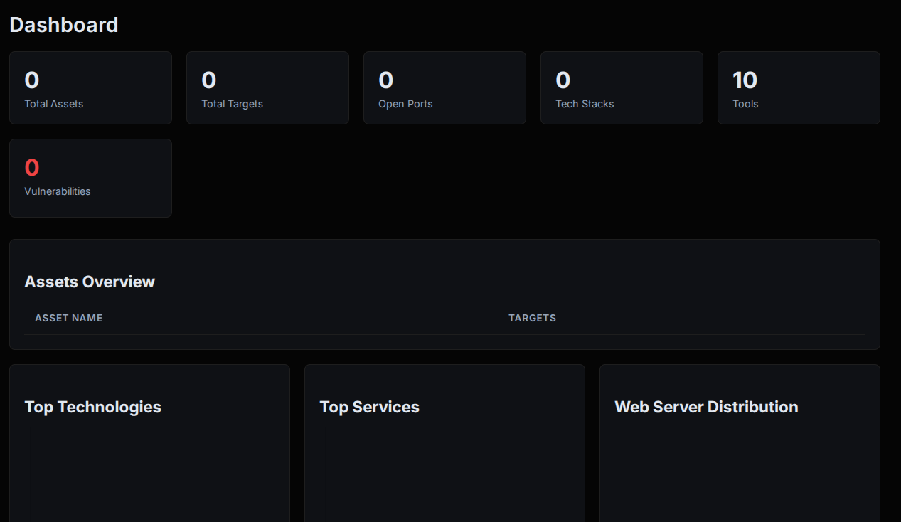
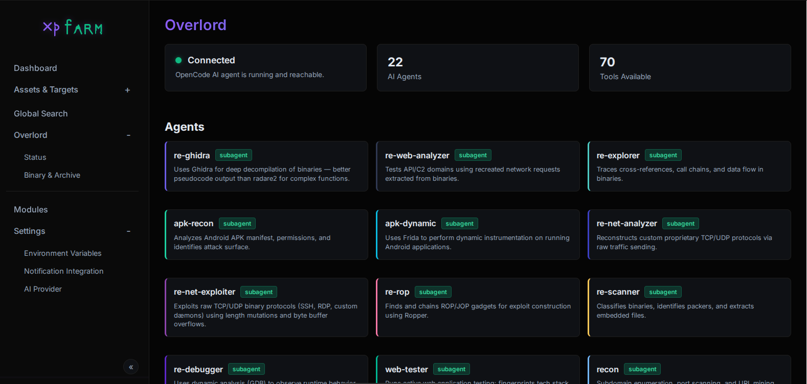
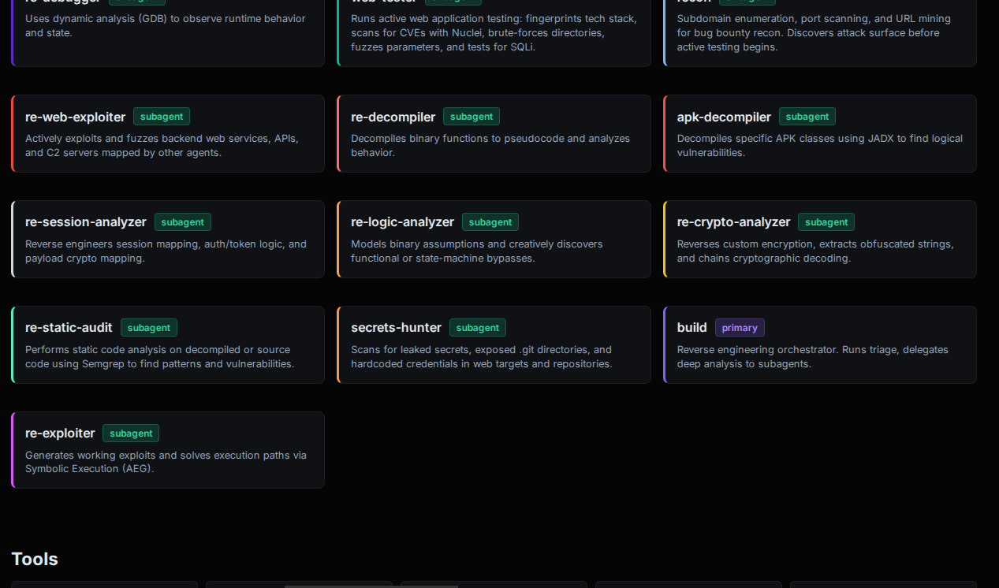
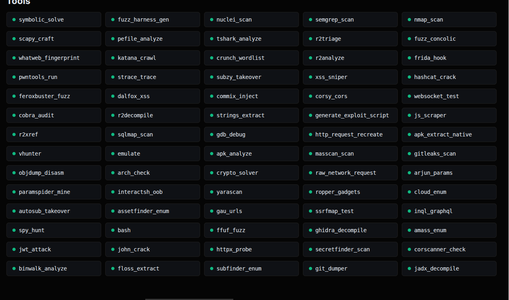
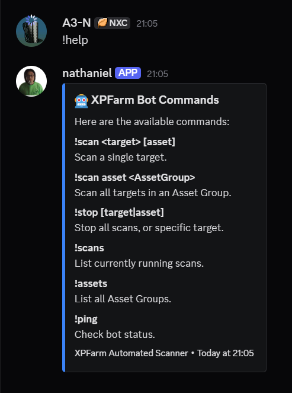
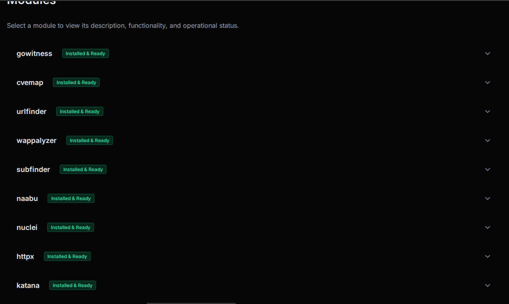

# XPFarm

An open-source AI-augmented offensive security platform that wraps well-known open-source security tools behind a unified web UI, with a community Plugin SDK and a Finding Normalization Engine.

[](https://ko-fi.com/canuk40)
if you love this project, check out my other project ObsidianBox Modern or download it from google play:
https://play.google.com/store/apps/details?id=com.busyboxmodern.app&hl=en_CA

---

### Index

| Section | Description |
|---|---|
| [Why](#why) | Motivation and philosophy behind XPFarm |
| [Wrapped Tools](#wrapped-tools) | The 10 open-source tools orchestrated by XPFarm |
| [Architecture Map](#architecture-map) | Full system architecture, scan pipeline, data flow, and AI subsystem |
| [Overlord - AI Binary Analysis](#overlord---ai-binary-analysis) | Built-in AI agent for binary/malware analysis |
| [Plugin SDK](#plugin-sdk) | Community-extensible Tool, Agent, and Pipeline system |
| [Finding Normalization Engine](#finding-normalization-engine) | Unified, enriched, deduplicated security findings |
| [Repo Scanner](#repo-scanner) | Git repos as first-class scan targets: SAST, secrets, SBOM |
| [Scan Graph](#scan-graph) | Interactive graph of assets, services, vulns, and exploits |
| [What's New](#whats-new) | Security, reliability, and UX improvements |
| [Setup](#setup) | Build and deployment instructions |
| [TODO](#todo) | Planned features and roadmap |

---



## Architecture Map

```mermaid
flowchart TB
    subgraph ENTRY["Entrypoint - main.go"]
        M1["Parse Flags<br/>-debug mode"]
        M2["InitDB<br/>SQLite + WAL + GORM<br/>FindingRecord + GroupRecord tables"]
        M3["InitModules<br/>Register 10 tool wrappers"]
        M4["Load Plugins<br/>normalization/all + plugins/all<br/>via init() blank imports"]
        M5["Health Check<br/>Auto-install missing tools"]
        M6["CheckAndIndexTemplates<br/>Nuclei template versioning"]
        M7["StartServer<br/>Gin on :8888"]
        M1 --> M2 --> M3 --> M4 --> M5 --> M6 --> M7
    end

    subgraph UI_LAYER["Web UI - internal/ui/server.go"]
        direction TB
        GIN["Gin HTTP Server<br/>Embedded templates + static<br/>CSRF origin-check middleware"]

        subgraph Pages["HTML Pages"]
            P1["Dashboard<br/>SSE live stage progress"]
            P2["Assets"]
            P3["Asset Details"]
            P4["Target Details"]
            P5["Modules"]
            P6["Settings<br/>AES-256-GCM encrypted"]
            P7["Overlord Chat"]
            P8["Overlord Binary<br/>500MB cap + MIME check"]
            P9["Search<br/>Paginated + truncation banner"]
            P10["Advanced Scan"]
            P11["Scan Settings"]
        end

        subgraph REST["REST API"]
            direction LR
            A1["POST /api/scan"]
            A2["POST /api/search"]
            A3["GET/POST /api/overlord/*"]
            A4["POST /assets/create|delete"]
            A5["POST /settings/*"]
            A6["GET /api/scan/events<br/>SSE stage progress"]
            A7["POST /api/search/save|delete"]
            A8["GET /api/overlord/events<br/>SSE Proxy"]
            A9["GET /api/plugins"]
            A10["POST /api/normalize"]
            A11["GET /api/findings"]
            A12["GET /api/findings/:id"]
            A13["GET /api/groups"]
            A14["POST /api/repos/add"]
            A15["GET /api/repos"]
            A16["POST /api/repos/scan/:id"]
            A17["GET /api/repos/:id/findings"]
            A18["GET /api/repos/:id/sbom"]
            A19["GET /graph (page)"]
            A20["GET /api/graph"]
            A21["GET /api/graph/nodes"]
            A22["GET /api/graph/edges"]
            A23["GET /api/graph/node/:id"]
        end

        GIN --> Pages
        GIN --> REST
    end

    subgraph SCAN_ENGINE["Scan Engine - internal/core/"]
        direction TB
        SM["ScanManager<br/>Singleton, mutex-guarded<br/>Panic recovery + SSE broadcast"]

        subgraph PIPELINE["8-Stage Scanning Pipeline - manager.go"]
            direction TB
            S0["Target Input<br/>ParseTarget + NormalizeToHostname"]
            S1["Stage 1: Subfinder<br/>Subdomain Discovery"]
            S2["Stage 2: Filter & Save<br/>ResolveAndCheck per subdomain<br/>Cloudflare / Localhost / Alive"]
            S3["Stage 3: Naabu<br/>Port Scanning<br/>5-worker pool via channel"]
            S4["Stage 4: Nmap<br/>Service Enumeration<br/>Version + Script detection"]
            S5["Stage 5: Httpx<br/>HTTP Probing<br/>Rich metadata extraction"]
            S6["Stage 6: Parallel Web Processing"]
            S7["Stage 7: CVEMap<br/>CVE lookup by product/tech"]
            S8["Stage 8: Nuclei<br/>Vulnerability Scanning"]

            S0 --> S1 --> S2 --> S3 --> S4 --> S5 --> S6 --> S7 --> S8
        end

        subgraph STAGE6_DETAIL["Stage 6 - Parallel Web Asset Processing"]
            direction LR
            GW["Gowitness<br/>Screenshots"]
            KAT["Katana<br/>JS Crawling, depth=5"]
            UF["URLFinder<br/>URL Discovery"]
            WAP["Wappalyzer<br/>Tech Detection"]
        end

        SM --> PIPELINE
        S6 --> STAGE6_DETAIL
    end

    subgraph PLUGIN_SDK["Plugin SDK - internal/plugin/ + plugins/"]
        direction TB
        PI["Tool / Agent / Pipeline interfaces"]
        PR["Global registry<br/>RegisterTool / RegisterAgent / RegisterPipeline"]
        PL["plugins/all/all.go<br/>blank-import bootstrap"]

        subgraph EXAMPLES["Bundled Plugins"]
            direction LR
            EP1["example-echo<br/>EchoTool + EchoAgent"]
            EP2["example-repo-scanner<br/>RepoScannerTool + RepoScannerAgent"]
            EP3["repo-semgrep<br/>SemgrepScannerTool + SemgrepAgent"]
            EP4["repo-secrets<br/>SecretsScannerTool + SecretsAgent"]
        end

        PI --> PR
        PL --> PR
        EXAMPLES --> PR
    end

    subgraph NORM["Finding Normalization Engine - internal/normalization/"]
        direction TB

        subgraph ADAPTERS["Adapters"]
            direction LR
            NA1["nuclei<br/>JSONL → Finding<br/>CVE/CWE/CVSS extraction"]
            NA2["nmap<br/>host+ports → Finding<br/>NSE script CVE regex"]
            NA3["semgrep<br/>--json → Finding<br/>CWE from metadata"]
            NA4["gitleaks<br/>leak report → Finding<br/>35-rule CWE map"]
        end

        subgraph ENRICHERS["Enrichers (applied in order)"]
            direction LR
            E1["cwe<br/>40 keyword rules<br/>35 tag mappings"]
            E2["cvss<br/>NVD API v2<br/>cached per CVE"]
            E3["epss<br/>FIRST.org API<br/>cached per CVE"]
            E4["kev<br/>CISA KEV catalog<br/>sync.Once download"]
        end

        NP["Pipeline<br/>adapt → enrich → fingerprint → dedup → group"]
        DD["dedupe<br/>SHA-256 fingerprint"]
        GR["grouping<br/>by CWE/CVE/Severity/Target"]

        ADAPTERS --> NP
        ENRICHERS --> NP
        NP --> DD --> GR
    end

    subgraph STORAGE["Storage - internal/storage/"]
        direction LR
        FR["FindingRecord<br/>SQLite/GORM<br/>upsert by fingerprint"]
        GRP["GroupRecord<br/>SQLite/GORM<br/>member IDs JSON array"]
        RFR["RepoFindingRecord<br/>per-repo findings"]
        RTR["RepoTargetRecord<br/>tracked git repos"]
        SBOMR["SBOMRecord<br/>dependency snapshots"]
    end

    subgraph SCAN_GRAPH["Scan Graph - internal/graph/"]
        direction TB
        GB["BuildGraph(ctx, db)<br/>queries 5 tables<br/>deduplicates nodes/edges"]
        subgraph GNODES["Node Types"]
            direction LR
            GN1["asset (#8b5cf6)"]
            GN2["target (#0ea5e9)"]
            GN3["service (#10b981)"]
            GN4["tech (#f59e0b)"]
            GN5["vuln (#ef4444)"]
            GN6["exploit (#dc2626)"]
        end
        subgraph GEDGES["Edge Kinds"]
            direction LR
            GE1["owns"]
            GE2["exposes"]
            GE3["runs"]
            GE4["affected-by"]
            GE5["exploits"]
        end
        GSnapStore["GraphSnapshotRecord<br/>internal/storage/graph/<br/>SaveGraph / LoadLatest<br/>GetNodeByID / GetEdgesFrom"]
        GB --> GNODES
        GB --> GEDGES
        GB --> GSnapStore
    end

    subgraph REPO_SCANNER["Repo Scanner - internal/repo_scanner/"]
        direction TB
        RS["ScanRepo()<br/>7-stage pipeline<br/>context-cancellable"]
        subgraph REPO_STAGES["Stages"]
            direction LR
            RS1["Clone/Update<br/>--depth 1"]
            RS2["Semgrep SAST<br/>--config auto"]
            RS3["Gitleaks<br/>secret scan"]
            RS4["SecretFinder<br/>40+ regex patterns"]
            RS5["SBOM<br/>package.json/requirements.txt<br/>go.mod/pom.xml"]
            RS6["EnrichAll<br/>CWE→CVSS→EPSS→KEV"]
            RS7["Persist<br/>findings + SBOM"]
        end
        RS --> REPO_STAGES
    end

    subgraph DATABASE["Database - internal/database/"]
        direction TB
        DB["SQLite + WAL Mode<br/>GORM ORM<br/>10 open / 5 idle conns<br/>64MB WAL cap"]

        subgraph MODELS["Core Data Models"]
            direction LR
            DM1["Asset"]
            DM2["Target"]
            DM3["Port"]
            DM4["WebAsset"]
            DM5["Vulnerability"]
            DM6["CVE"]
            DM7["ScanResult"]
            DM8["ScanProfile"]
            DM9["NucleiTemplate"]
            DM10["SavedSearch"]
            DM11["Setting<br/>AES-256-GCM encrypted"]
        end

        DB --> MODELS
    end

    subgraph OVERLORD["Overlord - AI Agent Subsystem"]
        direction TB
        OV_PROXY["Overlord Proxy<br/>internal/overlord/overlord.go"]

        subgraph OV_AGENTS["19 Specialized Agents"]
            direction LR
            OA1["Binary RE agents<br/>re-explorer, re-debugger<br/>re-decompiler, re-scanner"]
            OA2["APK agents<br/>apk-recon, apk-dynamic<br/>apk-decompiler"]
            OA3["Web + Exploit agents<br/>web-tester, re-exploiter<br/>secrets-hunter, recon"]
        end

        subgraph OV_TOOLS["75 TypeScript Tools"]
            OT1["radare2, ghidra, binwalk<br/>frida, angr, strings"]
            OT2["semgrep, gitleaks, gau<br/>corscanner, whatweb"]
            OT3["git_dumper, js_scraper<br/>crypto_solver, ropper"]
        end

        subgraph PROVIDERS["21 AI Providers"]
            direction LR
            PR1["Anthropic / OpenAI / Groq"]
            PR2["DeepSeek / Ollama / xAI"]
            PR3["OpenRouter / Cerebras / Together"]
        end

        OV_PROXY --> OV_AGENTS
        OV_PROXY --> OV_TOOLS
        OV_PROXY --> PROVIDERS
    end

    subgraph DOCKER["Docker Deployment - docker-compose.yml"]
        direction LR
        DC1["xpfarm container<br/>Go app on :8888"]
        DC2["overlord container<br/>OpenCode serve :3000"]
        DC3["mobsf container<br/>Mobile scan :8000<br/>optional profile"]
        DC1 <-->|xpfarm-network| DC2
        DC1 <-->|xpfarm-network| DC3
    end

    subgraph NOTIFICATIONS["Notifications - internal/notifications/"]
        direction LR
        N1["Discord Bot"]
        N2["Telegram Bot"]
    end

    %% Cross-component connections
    M7 --> GIN
    A1 --> SM
    A2 --> NORM
    A3 --> OV_PROXY
    A9 --> PLUGIN_SDK
    A10 --> NORM
    A11 --> STORAGE
    A12 --> STORAGE
    A13 --> STORAGE
    A14 --> REPO_SCANNER
    A15 --> REPO_SCANNER
    A16 --> REPO_SCANNER
    A17 --> REPO_SCANNER
    A18 --> REPO_SCANNER
    A19 --> SCAN_GRAPH
    A20 --> SCAN_GRAPH
    A21 --> SCAN_GRAPH
    A22 --> SCAN_GRAPH
    A23 --> SCAN_GRAPH
    SM -->|reads/writes| DB
    SM -->|SSE broadcast| A6
    SM -->|callbacks| N1
    SM -->|callbacks| N2
    NORM --> STORAGE
    REPO_SCANNER --> STORAGE
    STORAGE --> DB
```



## Why

Tools like [Assetnote](https://www.assetnote.io/) are great - well maintained, up to date, and transparent about vulnerability identification. But they're not open source. There's no need to reinvent the wheel either, as plenty of solid open-source tools already exist. XPFarm just wraps them together so you can have a vulnerability scanner that's open source and less corporate.

The focus was on building a vuln scanner where you can also see what fails or gets removed in the background, instead of wondering about that mystery.

## Wrapped Tools

- [Subfinder](https://github.com/projectdiscovery/subfinder) - subdomain discovery
- [Naabu](https://github.com/projectdiscovery/naabu) - port scanning
- [Httpx](https://github.com/projectdiscovery/httpx) - HTTP probing
- [Nuclei](https://github.com/projectdiscovery/nuclei) - vulnerability scanning
- [Nmap](https://nmap.org/) - network scanning
- [Katana](https://github.com/projectdiscovery/katana) - crawling
- [URLFinder](https://github.com/projectdiscovery/urlfinder) - URL discovery
- [Gowitness](https://github.com/sensepost/gowitness) - screenshots
- [Wappalyzer](https://github.com/projectdiscovery/wappalyzergo) - technology detection
- [CVEMap](https://github.com/projectdiscovery/cvemap) - CVE mapping


#### Credits

<table>
  <tr>
    <td align="center">
      <a href="https://github.com/Asjidkalam">
        <br/>
        <sub>Asjidkalam</sub>
      </a>
    </td>
    <td align="center">
      <a href="https://github.com/jamoski3112">
        <br/>
        <sub>jamoski3112</sub>
      </a><br/>
      <sub><a href="https://rahulr.in/reversing-a-cheap-ip-camera-to-root/">Research</a></sub>
    </td>
  </tr>
</table>

## Overlord - AI Binary Analysis

Overlord is a built-in AI agent powered by [OpenCode](https://opencode.ai) that can analyze binaries, archives, and other files. Upload a binary and chat with it - the agent uses tools like radare2, strings, file triage, and more to investigate your target.

- **Live streaming output** - see thinking, tool calls, and results as they happen
- **Session history** - switch between previous analysis sessions, auto-restored on page refresh
- **Multi-provider support** - Anthropic, OpenAI, Groq, Ollama (local), and 15+ more
- **Stop button** - abort long-running analysis at any time
- **75 TypeScript tools** - radare2, Ghidra, Frida, binwalk, angr, Semgrep, Gitleaks, and more
- **19 specialized agents** - binary RE, APK analysis, web testing, exploit generation, secrets hunting







## Plugin SDK

XPFarm is extensible via a community Plugin SDK. Anyone can add new Tools, Agents, and Pipelines without touching core code.

```
plugins/
├── all/all.go                    ← add your plugin import here
├── example-echo/                 ← minimal starter template
│   ├── plugin.go                 ← implement Tool/Agent, call Register* in init()
│   └── plugin.yaml               ← name, version, author, description
├── example-repo-scanner/         ← mock repo scanner example
│   ├── plugin.go
│   └── plugin.yaml
├── repo-semgrep/                 ← Semgrep SAST plugin (production-ready)
│   ├── plugin.go
│   └── plugin.yaml
└── repo-secrets/                 ← Gitleaks + SecretFinder plugin (production-ready)
    ├── plugin.go
    └── plugin.yaml
```

**Writing a plugin — three steps:**
1. Create `plugins/my-plugin/plugin.go` — implement `Tool` and/or `Agent`, call `plugin.RegisterTool()` / `plugin.RegisterAgent()` in `init()`
2. Create `plugins/my-plugin/plugin.yaml` — metadata
3. Add `_ "xpfarm/plugins/my-plugin"` to `plugins/all/all.go`

**API:** `GET /api/plugins` lists all registered tools, agents, pipelines, and manifests.

## Finding Normalization Engine

Raw scanner outputs from Nuclei, Nmap, Semgrep, and Gitleaks are normalized into a unified `Finding` model, enriched with live threat intelligence, deduplicated, and grouped.

```
POST /api/normalize  {"source": "nuclei", "raw": {...}}
         │
         ▼  Adapter (nuclei / nmap / semgrep / gitleaks)
         │  → canonical Finding (CVE, CWE, severity, evidence, tags)
         │
         ▼  Enrichers (applied in order)
         │  1. CWE   — 40-rule keyword trie + 35-tag map (local, instant)
         │  2. CVSS  — NVD REST API v2, CVSS 3.1→3.0→2.0, in-process cache
         │  3. EPSS  — FIRST.org exploitation probability API, in-process cache
         │  4. KEV   — CISA Known Exploited Vulnerabilities catalog (sync.Once)
         │
         ▼  SHA-256 fingerprint → deduplicate → group by CWE/CVE/Severity/Target
         │
         ▼  SQLite storage (FindingRecord + GroupRecord)
         │
         ▼  {findings, groups, count}
```

**REST API:**

| Endpoint | Description |
|---|---|
| `POST /api/normalize` | Normalize raw scanner output, save and return findings |
| `GET /api/findings` | List findings — filter by `source`, `severity`, `cwe`, `cve`, `target`, `kev` |
| `GET /api/findings/:id` | Fetch a single finding by ID |
| `GET /api/groups` | List finding groups with all member findings |

## Repo Scanner

Scan Git repositories as first-class targets. XPFarm clones the repo, runs all analysis stages, persists findings and a dependency SBOM, and exposes everything through a REST API.

**7-stage pipeline:**

```
1. Clone / Update  → git clone --depth 1 (or fetch+reset if already present)
2. Semgrep SAST    → --config auto (all community rules, 1000+ checks)
3. Gitleaks        → commit history + working tree secret scan (if installed)
4. SecretFinder    → 40+ built-in patterns: AWS, GitHub, Stripe, Slack, JWT, PEM, etc.
5. SBOM            → parse package.json / requirements.txt / go.mod / pom.xml
6. Enrich          → CWE → CVSS (NVD) → EPSS (FIRST.org) → KEV (CISA)
7. Persist         → findings + SBOM snapshots in SQLite
```

**REST API:**

| Endpoint | Description |
|---|---|
| `POST /api/repos/add` | Register a Git repo: `{"url": "…", "branch": "main"}` |
| `GET /api/repos` | List all tracked repositories |
| `DELETE /api/repos/:id` | Remove a repo and all its findings/SBOMs |
| `POST /api/repos/scan/:id` | Trigger an async scan (returns 202 immediately) |
| `GET /api/repos/:id/findings` | List findings — filter by `source`, `severity`, `cwe`, `cve`, `kev` |
| `GET /api/repos/:id/sbom` | Latest SBOM — all detected dependencies with name, version, file, kind |

**SBOM manifest support:**

| File | Ecosystem | Captures |
|---|---|---|
| `package.json` | Node.js | `dependencies` + `devDependencies` |
| `requirements.txt` | Python | PEP 440 version specifiers |
| `go.mod` | Go | `require` blocks, direct + indirect |
| `pom.xml` | Java/Maven | `<dependency>` blocks with groupId:artifactId, scope |

## Scan Graph

XPFarm builds a unified directed graph of every entity discovered during scanning, making it trivial to answer questions like _"what services are running tech with an active CVE exploit?"_ or _"show me everything reachable from this asset"_.

**Data model:**

| Node | Color | Shape | Populated from |
|---|---|---|---|
| `asset` | `#8b5cf6` purple | hexagon | Asset table |
| `target` | `#0ea5e9` blue | ellipse | Target table |
| `service` | `#10b981` green | diamond | Port table (open ports) |
| `tech` | `#f59e0b` amber | rectangle | WebAsset.TechStack + Port.Product |
| `vuln` | `#ef4444` red | triangle | Vulnerability + CVE tables |
| `exploit` | `#dc2626` dark-red | star | CVEs with `IsKEV=true` AND `HasPOC=true` |

**Edge kinds:**

| Edge | Meaning |
|---|---|
| `asset → target` owns | An asset owns a discovered target |
| `target → service` exposes | A target has an open port/service |
| `service → tech` runs | A service runs a detected technology |
| `target → vuln` affected-by | A target has a vulnerability or CVE finding |
| `vuln → exploit` exploits | A CVE has a known public exploit |

**Example paths:**

```
example.com (asset)
  └─owns──► www.example.com (target)
              ├─exposes──► 443/tcp https (service)
              │              └─runs──► nginx 1.24 (tech)
              ├─affected-by──► CVE-2023-44487 (vuln)
              │                   └─exploits──► Exploit: CVE-2023-44487 (exploit)
              └─affected-by──► http-missing-security-headers (vuln)

android-app.apk (asset)
  └─owns──► apk://com.example.app (target)
              ├─runs──► OkHttp (tech)
              └─affected-by──► hardcoded-api-key (vuln)
```

**Visualization (`GET /graph`):**
- Full-page interactive Cytoscape.js canvas — zoom, pan, drag
- Left panel: filter by node type, vuln severity, edge kind
- Click any node → right panel shows all properties + deep-link to asset/target detail page
- Stats panel: node/edge counts per type
- "Rebuild Graph" button re-queries live DB

**REST API:**

| Endpoint | Description |
|---|---|
| `GET /api/graph` | Full graph JSON; saves snapshot for query helpers |
| `GET /api/graph/nodes?type=vuln` | Nodes, optional `?type=` filter |
| `GET /api/graph/edges?kind=exploits` | Edges, optional `?kind=` filter |
| `GET /api/graph/node/:id` | Single node + incoming/outgoing edges from latest snapshot |

**React component (`ui/src/components/GraphView/`):**
A standalone TypeScript component (`GraphView.tsx`) ships with the same capabilities — usable in any React 18 app with `npm install cytoscape @types/cytoscape`.

## What's New

- **Scan Graph** — interactive Cytoscape.js visualization of assets→targets→services→techs→vulns→exploits; 5 edge kinds; filter by type/severity/kind; click-to-inspect side panel; REST API + React TSX component
- **Repo Scanner** — Git repos as first-class targets; 7-stage pipeline (SAST, secrets, SBOM); full REST API; async scan with per-repo findings and SBOM snapshots
- **Plugin SDK** — community-extensible Tool / Agent / Pipeline system; 2 production-ready repo scanner plugins (`repo-semgrep`, `repo-secrets`); add a plugin in 3 steps
- **Finding Normalization Engine** — unified model across Nuclei, Nmap, Semgrep, Gitleaks; live CVSS/EPSS/KEV enrichment; SHA-256 dedup; CWE/CVE/severity grouping
- **Secrets encrypted at rest** — API keys stored in SQLite are encrypted with AES-256-GCM. Key file auto-generated at `data/.xpfarm.key`, never committed
- **Real-time scan progress** — Dashboard streams live stage updates via SSE instead of polling
- **Search pagination** — 100 rows/page with truncation warning when results exceed the limit
- **Goroutine panic recovery** — Panics in scan goroutines are caught, logged, and cleaned up gracefully
- **CSRF protection** — Cross-origin POST requests rejected; only localhost accepted
- **File upload hardening** — Binary uploads capped at 500 MB, MIME type validated before saving
- **Silent failure surfaces** — CSV import errors, Nuclei parse failures, and search truncation reported to user
- **Tool version pinning** — All 10 security tools pinned in Dockerfile; `./xpfarm.sh update` for opt-in upgrades
- **DB connection tuning** — 10 open / 5 idle connection pool; 64 MB WAL journal cap
- **N+1 dashboard fix** — Asset target counts use a single `GROUP BY` query

## Setup

```bash
# Using the helper scripts (recommended)
./xpfarm.sh build     # Build all containers
./xpfarm.sh up        # Start everything
./xpfarm.sh update    # Rebuild with latest tool versions (opt-in upgrade)

# Windows
.\xpfarm.ps1 build
.\xpfarm.ps1 up

# Standard Docker
docker compose up --build

# Build from source (no Overlord)
go build -o xpfarm
./xpfarm
./xpfarm -debug
```


## Random Screenshots






## TODO

- [ ] Custom model
- [ ] Mobile scan
- [ ] Repo Scanner UI — web page to add repos, trigger scans, view findings and SBOM
- [ ] SBOM vulnerability matching — cross-reference SBOM dependencies against CVE/GHSA databases
- [ ] Custom Module?
